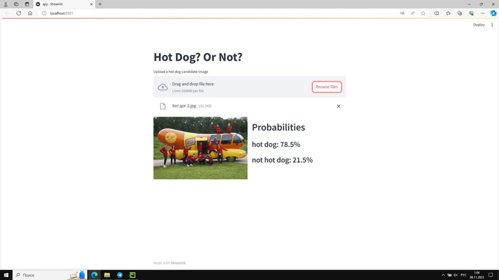
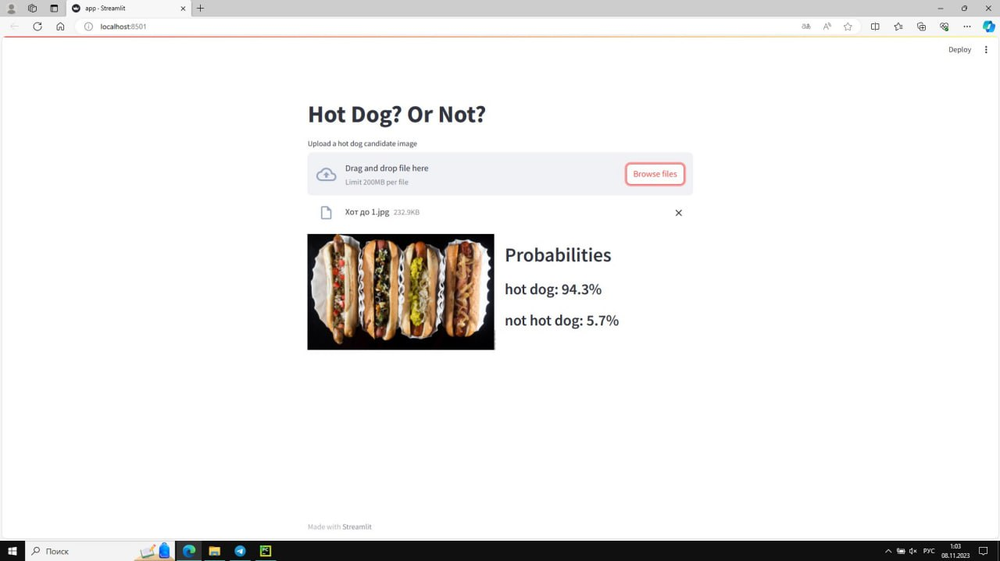
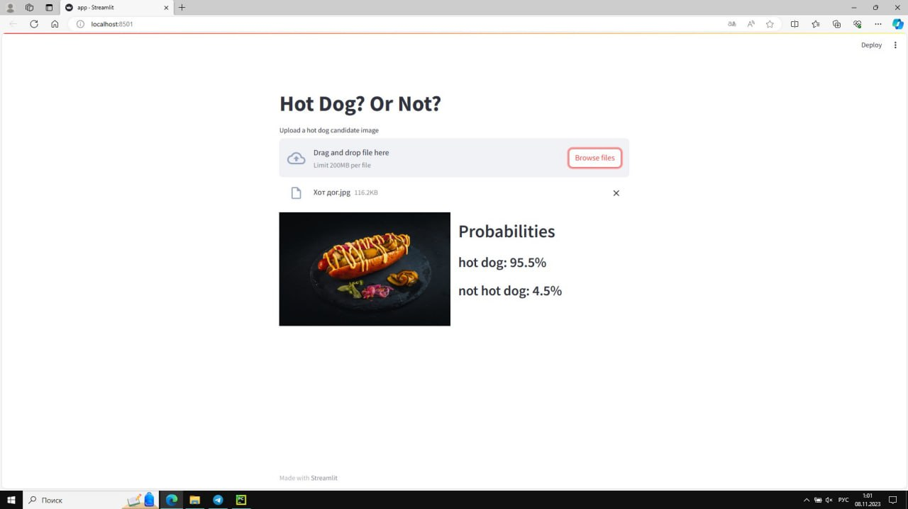
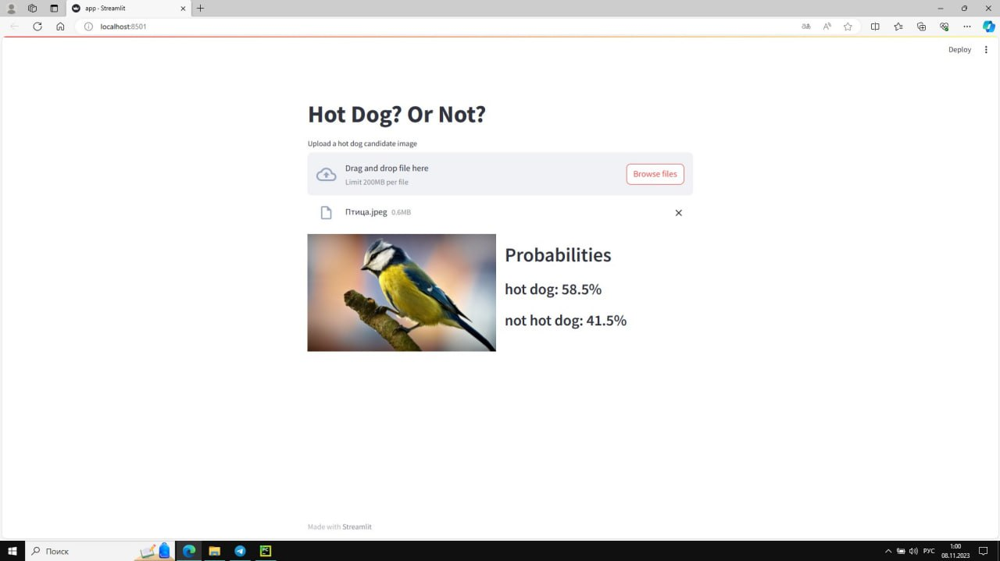
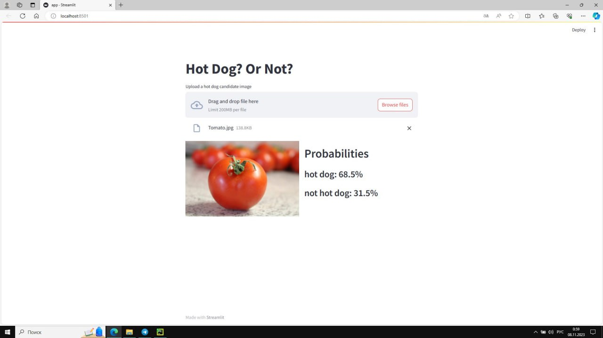
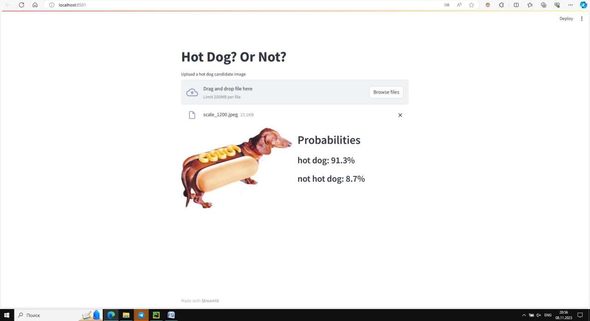

# hotdog-not-hotdog
Этот проект - простое приложение для классификации изображений "Хот дог или нет", созданное с использованием Streamlit и Hugging Face Transformers. Оно определяет, является ли загруженное изображение хот догом или нет, отображая вероятность совпадения изображения. Основано на модели "Hot Dog Not Hot Dog" из Hugging Face Model Hub.

## Hot Dog? Or Not?

В данном репозитории содержится скрипт на языке Python, использующий библиотеку Streamlit и Hugging Face Transformers для создания простого приложения для классификации изображений. Данное приложение позволяет определить, является ли загруженное изображение хот догом (hot dog) или нет.

### Предварительные требования

Для работы данного приложения необходимы следующие установленные компоненты:

- Python
- Streamlit
- Hugging Face Transformers
- torch
- numpy
- PIL

### Установка

1. Клонируйте данный репозиторий на свой компьютер или загрузите файл скрипта.

2. Установите необходимые библиотеки с помощью следующей команды:
   ```
   pip install streamlit transformers torch numpy Pillow
   ```

### Использование

1. Откройте терминал или командную строку и перейдите в директорию, где находится файл скрипта.

2. Запустите следующую команду, чтобы запустить приложение:
   ```
   streamlit run app.py
   ```

3. Доступ к приложению можно получить в веб-браузере, перейдя по адресу `http://localhost:8501`.

4. Нажмите кнопку "Загрузить изображение для тестирования", чтобы выбрать изображение для классификации.

5. Приложение отобразит загруженное изображение вместе с предсказанными вероятностями того, что изображение является хот догом или нет.

### Благодарности

Скрипт основан на модели [Hot Dog Not Hot Dog](https://huggingface.co/julien-c/hotdog-not-hotdog) из Hugging Face Model Hub.

### Лицензия

Данный проект лицензирован в соответствии с [лицензией MIT](LICENSE).












